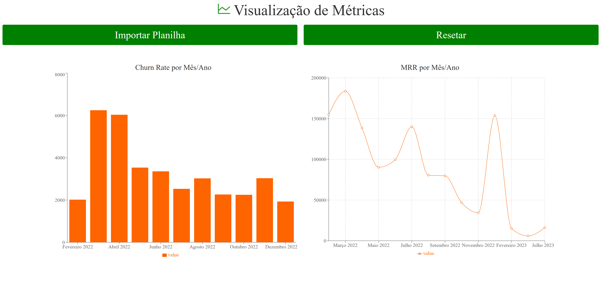

# FRONT METRICS
Aplicativo para mostragem das Métricas MRR e Churn Rate

<h1 align="center">
  
</h1>

## Especificações
- Node: 20.10.0
- Pacote de Gerenciamento de Dependências: NPM
- Framework: React + Vite

## Como instalar as dependências
```bash
$ npm install
```

## Rodar o Frontend
```bash
$ npm run dev
```